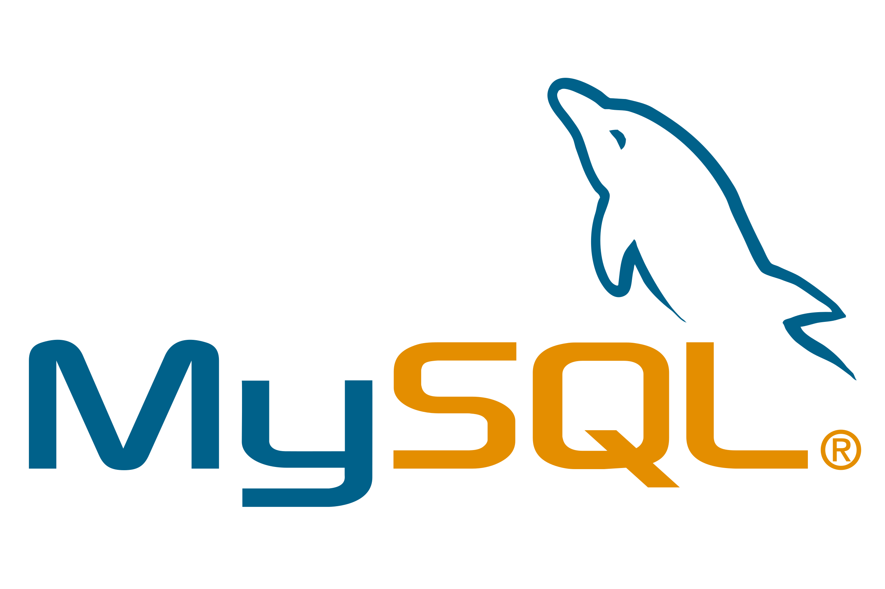
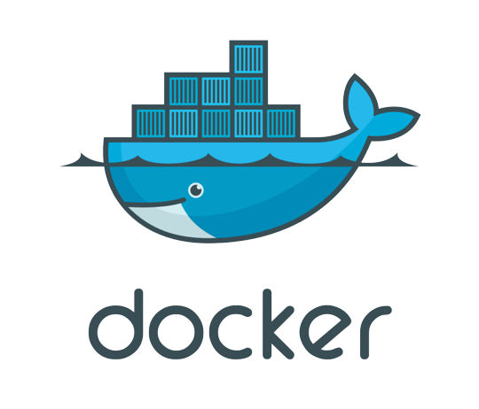
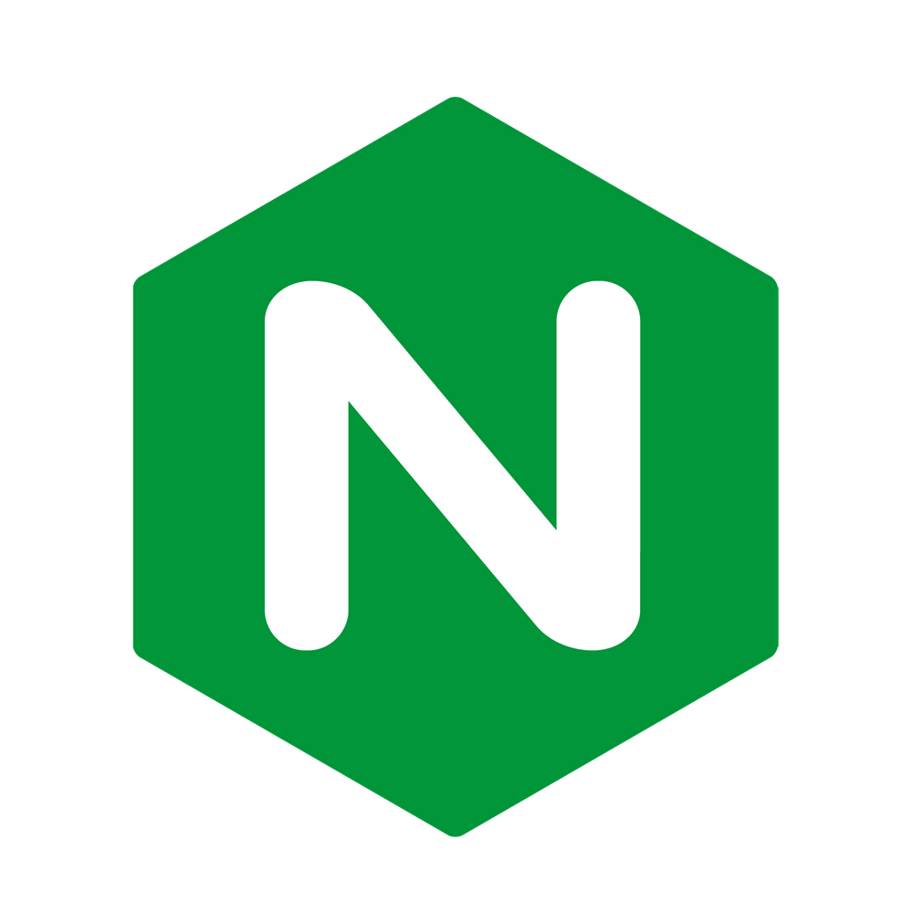
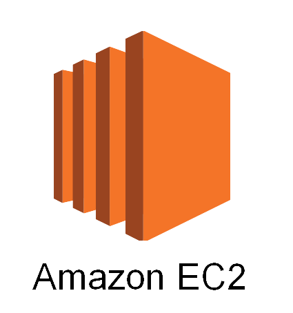

# 방방곡곡

방탈출 테마, 방방곡곡에서 찾아보세요

## Table of Content

1. [서비스 개요](#1-서비스-개요)
1. [기술 스택](#2-기술-스택)
1. [한눈에 보는 시스템 아키텍처](#3-한눈에-보는-시스템-아키텍처)
1. [팀원 소개](#4-팀원-소개)
1. [Jira Convention](#5-jira-convention)
1. [Git Flow Convention](#6-git-flow-convention)
1. [Commit Message Convention](#7-commit-message-convention)
1. [Backend Convention](#8-backend-convention)
1. [Frontend Convention](#9-frontend-convention)
1. [Wire Frames](#10-wire-frames)
1. [기능 정의서](#11-기능-정의서)
1. [ERD](#12-erd)
1. [Sequence Diagram](#13-sequence-diagram)
1. [References](#14-references)

## 1. 서비스 개요

저희의 서비스는 **방탈출 테마 맞춤 추천 플랫폼**입니다.

- 전국에 있는 방탈출 지점과 테마를 제공합니다.
- 방문한 테마에 대해 리뷰를 작성할 수 있습니다.
- 프로필에서 방문한 테마들의 정보를 통계로 볼 수 있습니다.
- 자신이 방문한 테마 정보를 바탕으로 사용자에게 맞춤 테마를 추천해줍니다.
- 테마에 같이 도전할 사용자들을 입력하여 그룹을 생성하고 그룹에게 맞춤 테마를 추천해줍니다.

## 2. 기술 스택

### FrontEnd

| <div align="center"> </div> | <div align="center"></div> | <div align="center"></div> |
| :-----------------------------------------------------------------------------------------------------: | :--------------------------------------------------------------------------------------------------: | :-------------------------------------------------------------------------------------------------------: |
|                                      &nbsp;&nbsp;HTML5&nbsp;&nbsp;                                      |                         &nbsp;&nbsp;&nbsp;&nbsp;CSS3&nbsp;&nbsp;&nbsp;&nbsp;                         |                                                JavaScript                                                 |

| <div align="center"> </div> | <div align="center"> </div> | <div align="center"> </div> |
| :------------------------------------------------------------------------------------------------------: | :--------------------------------------------------------------------------------------------------------: | :-----------------------------------------------------------------------------------------------------------------------------: |
|                    &nbsp;&nbsp;&nbsp;&nbsp;&nbsp;React&nbsp;&nbsp;&nbsp;&nbsp;&nbsp;                     |                     &nbsp;&nbsp;&nbsp;&nbsp;&nbsp;Recoil&nbsp;&nbsp;&nbsp;&nbsp;&nbsp;                     |                                                        Styled-components                                                        |

| <div align="center"> </div> |
| :-------------------------------------------------------------------------------------------------------: |
|                                                   AXIOS                                                   |

### BackEnd

| <div align="center"> </div> | <div align="center"> </div> | <div align="center"></div> | <div align="center"></div> | <div align="center"></div> |
| :----------------------------------------------------------------------------------------------------: | :-----------------------------------------------------------------------------------------------------------------: | :------------------------------------------------------------------------------------------------------------------------: | :-------------------------------------------------------------------------------------------------------: | :-------------------------------------------------------------------------------------------------------------: |
|                                                  Java                                                  |                                                     Spring-Boot                                                     |                                                      Spring-Security                                                       |                    &nbsp;&nbsp;&nbsp;&nbsp;&nbsp;Gradle&nbsp;&nbsp;&nbsp;&nbsp;&nbsp;                     |                                  &nbsp;&nbsp;&nbsp;Hibernate&nbsp;&nbsp;&nbsp;                                  |

| <div align="center"> </div> | <div align="center"></div> |
| :--------------------------------------------------------------------------------------------------------: | :---------------------------------------------------------------------------------------------------------: |
|                                                  MySQL                                                   |                                                   Postman                                                   |

### DevOps

| <div align="center"> </div> | <div align="center"></div> | <div align="center"></div> | <div align="center"></div> | <div align="center"></div> |
| :--------------------------------------------------------------------------------------------------------: | :---------------------------------------------------------------------------------------------------------: | :-----------------------------------------------------------------------------------------------------: | :-------------------------------------------------------------------------------------------------: | :-----------------------------------------------------------------------------------------------: |
|                                                   Docker                                                   |                                                   Jenkins                                                   |                                                  NginX                                                  |                                               AWS EC2                                               |                                              AWS S3                                               |

## 3. 한눈에 보는 시스템 아키텍처


## 4. 팀원 소개

정상기 (팀장): Frontend 개발 + 프로젝트 관리

손예지 (팀원): Frontend 총괄 + 

김성수 (팀원): Frontend 개발 + 

이상민 (팀원): Backend 총괄 + 

이지원 (팀원): Backend 개발 + 

우상빈 (팀원): Backend 개발 + 


## 5. Jira Convention

Jira는 개발 이슈 트랙킹 용도로 사용합니다.

- 계층

  1.  (에픽)
  2.  (스토리),  (작업),  (버그)

- 이름 규칙

  - Epic은 story의 모음이고, task와 bug를 통해 story를 완성시킵니다.
  - 레이블에서 FE, BE 작업은 각각 프론트엔드 작업과 백엔드 작업 이름입니다. (한글로 상세히 작성해 주세요)
  - 예시)  로그인 /  로그인 view /  로그인 레이아웃 제작

- 이슈

  - 담당자, 우선순위, story point, label, Epic Link와 함께 이슈를 생성하세요
  - Backlog 탭에서 이슈를 미리 만들어 놓고, 매주 월요일 아침 회의를 통해 이슈를 개인별로 할당합니다. 할당한 이슈를 스프린트에 옮겨놓으세요
  - 해당 이슈를 완료하거나 작업을 시작했다면, Active sprints 탭에서 workflow (Todo, In-progress, Done)을 변경해주세요

- Burndown Chart
  - 번다운 차트는 스프린트별 시간당 잔여 Story-point 를 추적합니다
  - 주차별 스프린트를 시작하기 전에 모든 이슈를 생성하고 할당해야 올바른 번다운 차트를 생성할 수 있습니다

## 6. Git Flow Convention

디렉터리 구조는 **frontend** 와 **backend** 로 구분됩니다. 각 개발자들은 해당 디렉터리로 이동한다음 작업하면 됩니다

```
.
├── frontend
└── backend
```

Branch Types

- main: 제품으로 출시될 수 있는 브랜치
- fe-develop: Frontend 개발 브랜치
- be-develop: Backend 개발 브랜치
- fe-feature: Frontend 기능 개발 브랜치
- be-feature: Backend 기능 개발 브랜치
- fe-hotfix: Frontend 버그 수정 브랜치
- be-hotfix: Backend 버그 수정 브랜치


1. origin/develop 브랜치에서 작업 브랜치를 생성합니다

```
(fe-develop)]$ git fetch
(fe-develop)]$ git checkout -b fe-feature/user-login-layout --track origin/fe-develop
```

2. 작업 브랜치에서 작업합니다

3. 작업 브랜치에서 소스를 커밋합니다

```
(fe-feature/user-login-layout)]$ git commit -m "feat: add user login layout"
```

4. 작업 브랜치를 origin/develop에 rebase 합니다

```
(fe-feature/user-login-layout)]$ git pull --rebase origin fe-develop
```

5. 작업 브랜치를 origin에 push합니다

```
(fe-feature/user-login-layout)]$ git push origin fe-feature/user-login-layout
```

6. Gitlab에서 작업 브랜치를 develop에 합치도록 Merge Request 를 생성합니다
7. 동료에게 승인받고, merge 합니다

<!-- [ref](https://techblog.woowahan.com/2553/) -->

## 7. Commit Message Convention

Commit Message Types

- ⛏ fix: 내 코드베이스에서 발생한 버그를 수정했을 때
- :sparkles: feat: 새로운 기능을 추가했을 때
- 🔊 (ELEMENT)!: API를 바꿨을 때
- 📝: docs: 문서 수정
- 💡 refactor: 코드 리펙토링했을 때
- 🧪 test: 테스트 코드 추가 또는 수정했을 때
- 🎨 style: 코드 형식 바꿨을 때
- 💫 chore: 그 외 기타사항
- [fix 와 feat 외 타입들](https://github.com/conventional-changelog/commitlint/tree/master/%40commitlint/config-conventional)
- Examples:

```
~/SSAFY/my-app (be-feature/login) $ git commit -m " feat: allow provided config object to extend other configs"
```

```
~/SSAFY/my-app (be-feature/login) $ git commit -m "feat: check if ID is duplicated"
```

```
~/SSAFY/my-app (be-feature/login) $ git commit -m "feat!: send an email to the customer when a product is shipped"
```

```
~/SSAFY/my-app (be-feature/login) $ git commit -m "docs: correct spelling of CHANGELOG"
```

<!-- [Conventional Commits](https://www.conventionalcommits.org/en/v1.0.0/) -->

## 8. Backend Convention

- Style Guide
  - [Google Style Guide for Java](https://google.github.io/styleguide/javaguide.html)
- Project Structure

```
// backend 디렉터리 안에서
.
└── main                                    // java src 디렉터리
    ├── java
    │   └── com
    │       └── ssafy
    │           └── ssafy
    │               ├── api                 // REST API 디렉터리
    │               │   ├── controller      //
    │               │   ├── dto             //
    │               │   └── service         //
    │               ├── filter              //
    │               ├── util                //
    │               ├── config              // 
    │               │   ├──                 //
    │               │   └──                 //
    │               └── db                  // DB 디렉터리
    │                   ├── entity          //
    │                   └── repository      //
    └── resources                           // 웹 리소스 디렉터리
        └── application.properties

```

## 9. Frontend Convention

- Style Guide
  - [Google Style Guide for Typescript](https://google.github.io/styleguide/tsguide.html)
  - [gts](https://www.npmjs.com/package/gts)
- Project Structure

```
// frontend 디렉터리 안에서
.
├── public              // 
├── src                 // 
│   ├── api             // 
│   ├── assets          // 
│   ├── components      // 
│   │   ├──             //
│   │   └──             //
│   ├── pages           // 
│   └── store           // 
└── types               // 

```

## 10. Wire Frames


## 11. 기능 정의서

- 전체적 흐름도

- 자동 경매 흐름도

## 12. ERD


## 13. Sequence Diagram


## 14. References

- [우린 Git-flow를 사용하고 있어요](https://techblog.woowahan.com/2553/)
- [Conventional Commits](https://www.conventionalcommits.org/en/v1.0.0/)
- [Google Style Guide for Java](https://google.github.io/styleguide/javaguide.html)
- [Google Style Guide for Typescript](https://google.github.io/styleguide/tsguide.html)