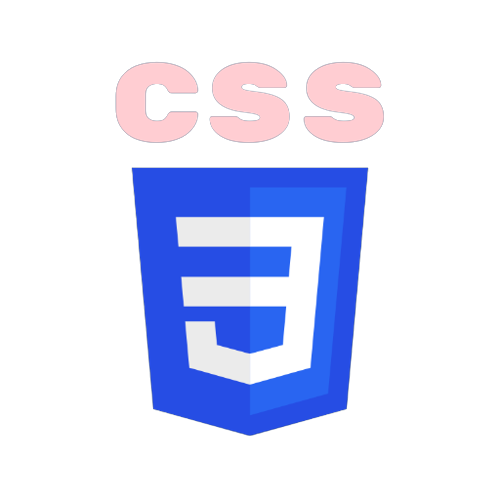
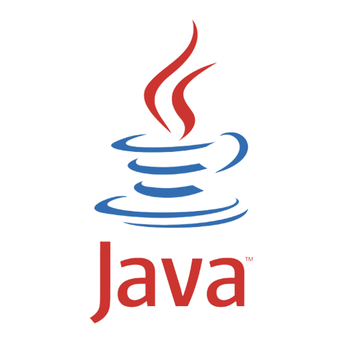
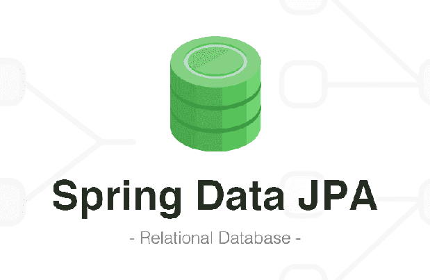
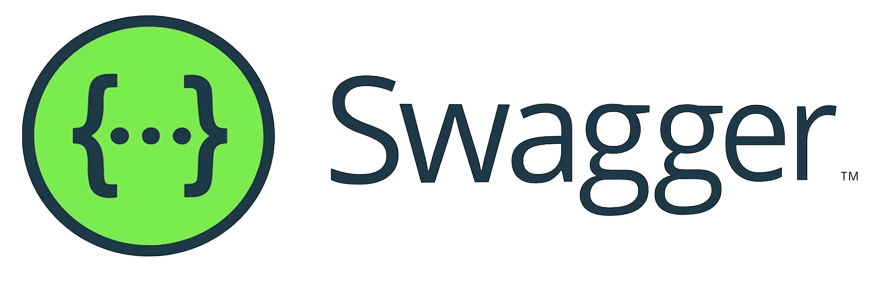
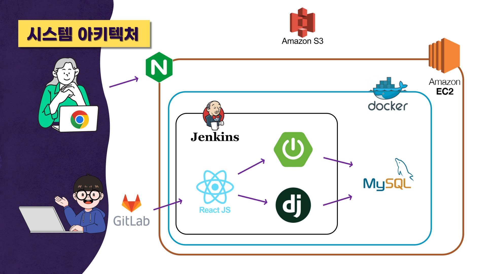
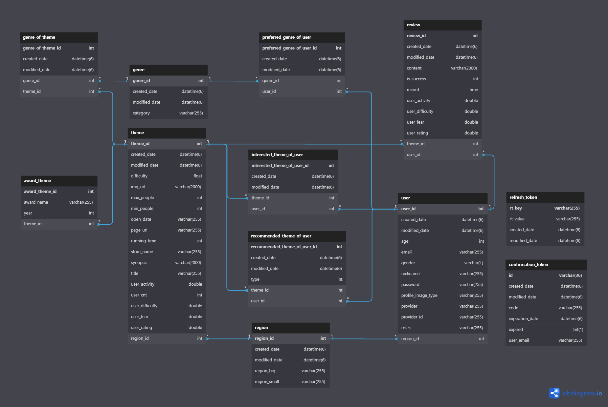
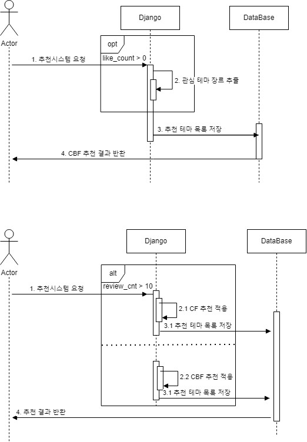

<div align="center">
  
</div>

<div align="center">
	<div>
    <h1>🔐 방방곡곡 ( 방탈출 테마 맞춤 추천 플랫폼 ) 🔓 </h1>
	  
	</div>
</div>
<br />

## 목차

### 1. [**서비스 개요**](#서비스-개요)

### 2. [**기술 스택**](#기술-스택)

### 3. [**주요 기능**](#주요-기능)

### 4. [**프로젝트 구성도**](#프로젝트-구성도)

### 5. [**UCC 영상**](#ucc-영상)

### 6. [**프로젝트 기간**](#프로젝트-기간)

### 7. [**팀원 소개**](#팀원-소개)

### 8. [**실행 방법**](#실행-방법)

<br />

<div id="1"></div>

# 📖서비스 개요

> 저희의 서비스는 **방탈출 테마 맞춤 추천 플랫폼**입니다.
>
> - 전국에 있는 모든 방탈출 테마를 제공합니다.
> - 방문한 테마에 대해 리뷰를 작성할 수 있습니다.
> - 프로필에서 방문한 테마들의 정보를 통계로 볼 수 있습니다.
> - 자신이 방문한 테마 정보를 바탕으로 사용자에게 맞춤 테마를 추천해줍니다.
> - 테마에 함께 갈 사용자들을 추가하고 해당 그룹에게 맞춤 테마를 추천해줍니다.

<br />

- [방방곡곡 웹 서비스 바로가기 Click! 👈](https://bbkk.store/)
- [방방곡곡 Notion 바로가기 Click! 👈](https://whimsybin.notion.site/1f9dc482d8f343d0b7026afcd4db33f7)

<br />

# 🛠 기술 스택

## FrontEnd

| <div align="center"> | <div align="center"> | <div align="center"> |
| :----------------------------------------------------------------------------------------------: | :--------------------------------------------------------------------------------------------: | :----------------------------------------------------------------------------------------------------------: |
|                            &nbsp;&nbsp;&nbsp;HTML5&nbsp;&nbsp;&nbsp;                             |                      &nbsp;&nbsp;&nbsp;&nbsp;CSS3&nbsp;&nbsp;&nbsp;&nbsp;                      |                                      &nbsp;&nbsp;TypeScript&nbsp;&nbsp;                                      |

| <div align="center"> | <div align="center"> | <div align="center"> |
| :------------------------------------------------------------------------------------------------: | :---------------------------------------------------------------------------------------------------: | :----------------------------------------------------------------------------------------------------------------------: |
|                             &nbsp;&nbsp;&nbsp;React&nbsp;&nbsp;&nbsp;                              |                                                Recoil                                                 |                                              &nbsp;Styled-Components&nbsp;                                               |

| <div align="center"> | <div align="center"> |
| :----------------------------------------------------------------------------------------------------------: | :-------------------------------------------------------------------------------------------------: |
|                                           &nbsp;Material-UI&nbsp;                                            |                                                AXIOS                                                |

<br />

## BackEnd

| <div align="center"> </div> | <div align="center"></div> | <div align="center"> </div> | <div align="center"></div> | <div align="center"></div> |
| :-----------------------------------------------------------------------------------------------------: | :--------------------------------------------------------------------------------------------------------: | :-----------------------------------------------------------------------------------------------------------------: | :-------------------------------------------------------------------------------------------------------------------------: | :----------------------------------------------------------------------------------------------------------------------: |
|                                                  Java                                                   |                                 &nbsp;&nbsp;&nbsp;Gradle&nbsp;&nbsp;&nbsp;                                 |                                                     Spring-Boot                                                     |                                                       Spring-Security                                                       |                                                &nbsp;SpringDataJPA&nbsp;                                                 |

| <div align="center"> </div> | <div align="center"></div> |
| :---------------------------------------------------------------------------------------------------------: | :----------------------------------------------------------------------------------------------------------: |
|                                       &nbsp;&nbsp;Python&nbsp;&nbsp;                                        |                                                    Django                                                    |

| <div align="center"> </div> | <div align="center"></div> |
| :-------------------------------------------------------------------------------------------------------: | :-----------------------------------------------------------------------------------------------------------: |
|                                                   MySQL                                                   |                                                    Swagger                                                    |

<br />

## DevOps

| <div align="center"> </div> | <div align="center"></div> | <div align="center"></div> | <div align="center"></div> | <div align="center"></div> |
| :---------------------------------------------------------------------------------------------------------: | :----------------------------------------------------------------------------------------------------------: | :------------------------------------------------------------------------------------------------------: | :--------------------------------------------------------------------------------------------------: | :------------------------------------------------------------------------------------------------: |
|                                                   Docker                                                    |                                             &nbsp;Jenkins&nbsp;                                              |                                      &nbsp;&nbsp;NginX&nbsp;&nbsp;                                       |                                         &nbsp;AWS EC2&nbsp;                                          |                                         &nbsp;AWS S3&nbsp;                                         |

<br />

<br />

<div id="3"></div>

# 💡 주요 기능

- **전국의 모든 방탈출 테마 정보 제공**

  ```
  전국에 있는 모든 방탈출 테마의 정보(사진, 장르, 시놉시스 등) 제공
  bbkk 사용자들의 리뷰들과 그를 바탕으로 한 여러 가지 체감 평가 요소 제공
  해당 테마들은 다양한 필터를 통해 쉽게 검색 가능
  ```

- **방문한 테마 리뷰 작성**

  ```
  방문한 테마에 대하여 간단하게 리뷰 작성 가능
  내 일기를 관리하는 것처럼 마이페이지에서 수정 및 관리 가능
  리뷰 작성 시 방문한 것으로 인식하여 추천 알고리즘 재계산
  ```

- **맞춤 추천 기능**

  ```
  좋아요(찜)을 눌러놓은 테마들의 장르를 바탕으로 유사한 장르를 가진 테마들을 찾아 CF 추천
  테마에 남긴 리뷰의 평가를 바탕으로 유사한 평가를 내린 유저들과 비교하여 CBF 테마 추천
  ```

- **그룹셋 형성**

  ```
  여러 사용자들을 등록하여 해당 구성원들 모두가 방문하지 않은 테마 찾기 가능
  해당 구성원들의 테마 별 리뷰 평가를 분석하여 최적의 테마를 Hybrid 추천
  ```

<br />

<div id="4"></div>

# 📂프로젝트 구성도

- **시스템 아키텍처**

  

<br />

- **ERD**

  
  
<br />

- **추천 Sequence Diagram**

  

<br />

# 🎥UCC 영상

[](https://youtu.be/youtube)

> 새 창 열기 방법 : Ctrl + click (on Windows and Linux) | CMD + click (on MacOS)

<br />

# 📅 프로젝트 기간

**2023.02.20(월) ~ 2023.04.07(금)**

<br />

# 👪팀원 소개

<!--
 -->

> - 정상기(팀장 / FE) : 로컬/SNS 로그인 + 그룹셋 페이지
> - 손예지(팀원 / FE) : 메인 페이지 + 상세 페이지
> - 김성수(팀원 / FE) : 검색 페이지 + 마이프로필 페이지
> - 이상민(팀원 / BE) : DB 설계 + 소셜 로그인 + API 개발
> - 이지원(팀원 / BE) : 서버 배포 + CI/CD + 추천 알고리즘 구축
> - 우상빈(팀원 / BE) : DataSet 수집 + API 개발

<br />

# 💻 실행 방법

**Client 실행**

1. 원격 저장소 복제

```git
$ git clone https://lab.ssafy.com/s08-bigdata-recom-sub2/S08P22A204.git
```

2. 프로젝트 폴더로 이동

```git
$ cd FrontEnd
```

3. 필요한 node_modules 설치

```git
$ npm i
```

4. 개발 서버 실행

```git
$ npm run dev
```

<br />

**Server 실행**

1. 원격 저장소 복제

```git
$ git clone https://lab.ssafy.com/s08-bigdata-recom-sub2/S08P22A204.git
```

2. 프로젝터 폴더 > src > main > resources 이동

```git
$ cd Backend
$ cd src
$ cd main
$ cd resources
```

3. 프로젝트 실행을 위한 application.properties 파일 작성

- /exec/포팅매뉴얼 참고하여 application.properties 작성 후 실행

4. 프로젝트 폴더 루트 경로로 이동

```git
$ cd Backend
```

5. 프로젝트 빌드

```git
$ ./gradlew clean build
```

6. 빌드 폴더 이동 후 jar 파일 실행

```git
$ cd build
$ java -jar [파일명].jar
```
